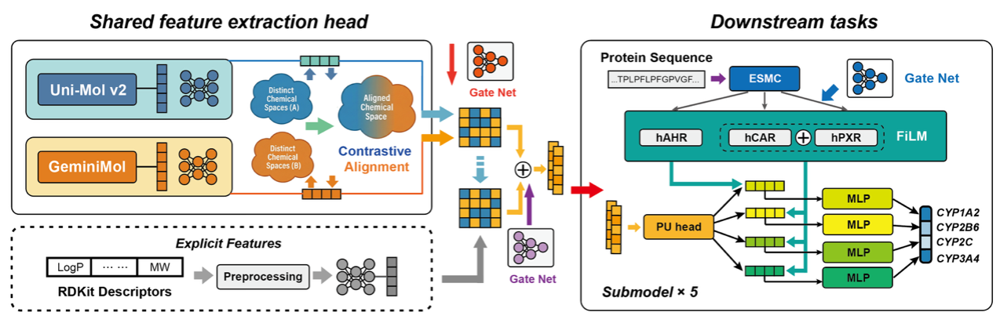

# ULCYP: A Multitask Model for Predicting P450 Inducers Based on Positive-Unlabeled Learning


## Abstract


Prediction of cytochrome P450 (CYP) induction is highly advantageous in early-stage drug discovery, as it helps mitigate the risks of drug-drug interactions and toxicity. However, the development of specialized predictive models for CYP induction remains limited, largely due to the scarcity of available inducer data. To address these challenges, we propose ULCYP, a multi-task deep learning framework based on positive-unlabeled (PU) learning for the prediction of CYP induction.  ULCYP effectively leverages large-scale unlabeled data to compensate for the lack of trustworthy negative samples, thereby enabling a more accurate estimation of the decision boundary. Comparative evaluations demonstrate that ULCYP outperforms baseline models across multiple performance metrics, achieving an average AUC greater than 0.81 on the test set comprising CYP inducers and non-agonists of key CYP induction mediators, including the pregnane X receptor (PXR), constitutive androstane receptor (CAR), and aryl hydrocarbon receptor (AhR). To enhance prediction reliability and interpretability, the integrated gradients method was employed to elucidate key molecular substructures driving model predictions, complemented by a rigorously defined applicability domain. 

## Web Server

A user-friendly web server for ULCYP is publicly available for online prediction and analysis:

https://lmmd.ecust.edu.cn/ULCYP/ 

---

## Data and Model Availability

To ensure accessibility and bypass file size limitations, the pre-trained **ULCYP model weights** and the complete **datasets** (including the Inducer/Non-agonist training sets and PU learning datasets) are hosted on [https://doi.org/10.5281/zenodo.18413808](https://doi.org/10.5281/zenodo.18413808).


###  Setup Instructions
After downloading the files from Zenodo, please organize them as follows to ensure the scripts run correctly:
1.  **Model Files:** Place the downloaded model weights into the **`model_results/`** directory.
2.  **Representations:** Ensure the pre-computed feature file (`TestDataset.joblib`) is placed in the same directory as the scripts or as specified in your arguments.

* **`TestDataset.joblib`**: Contains the pre-calculated Uni-Mol and GeminiMol representations.

---

## Repository Structure
Below is an overview of the key files and directories in this repository:

### Core Scripts

* **`predict_main.py`**
    * **Output:** Generates prediction probabilities for CYP induction.
    * **Usage:** Can be used directly for inference tasks.

* **`appin.py`**
    * **Output:** Generates complete results.

### Directories

* **`ulcyp/`**
    * Contains the pre-trained model files and checkpoints for the ULCYP framework.

* **`tools/`**
    * Includes the main utility functions and helper scripts required for data processing and model training.

* **`tools/other/`**
    * Contains supplementary files and auxiliary scripts that may be necessary for specific experimental setups or legacy compatibility.

---

##  Quick Start
1.  **Install dependencies:**
    ```bash
    pip install -r requirements.txt
    ```

2.  **Run Prediction:**
    ```bash
    python predict_main.py 
    ```

The model performs multi-task prediction. The specific mapping for the CYP induction tasks is as follows:

| Task ID | CYP Isoform |
| :---: | :---: |
| **Task 18** | CYP1A2 |
| **Task 19** | CYP2B6 |
| **Task 20** | CYP2C |
| **Task 21** | CYP3A4 |


[](LICENSE) [](https://www.python.org/)